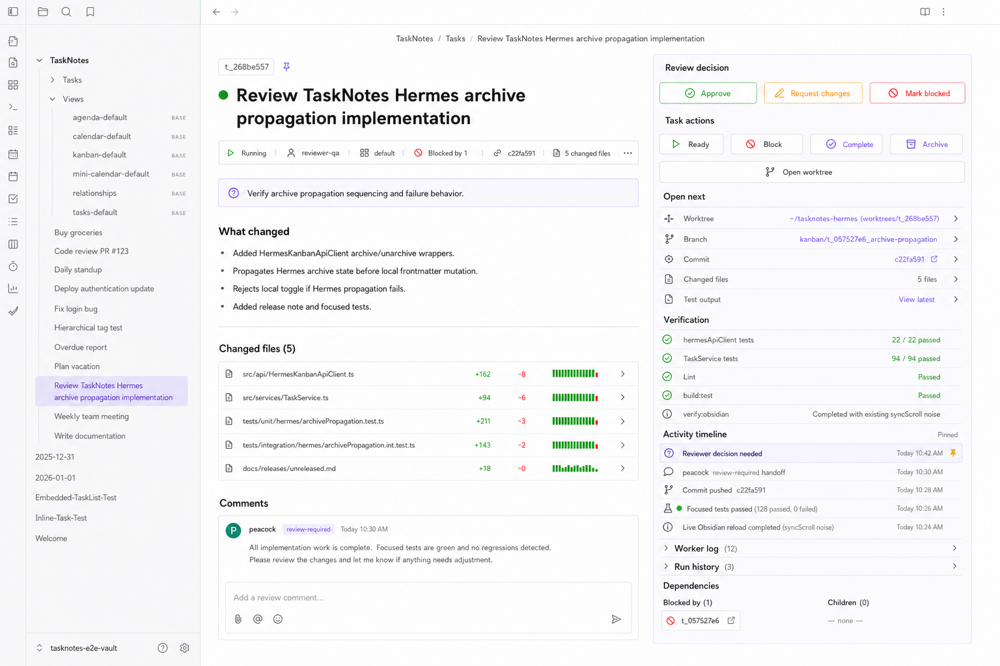
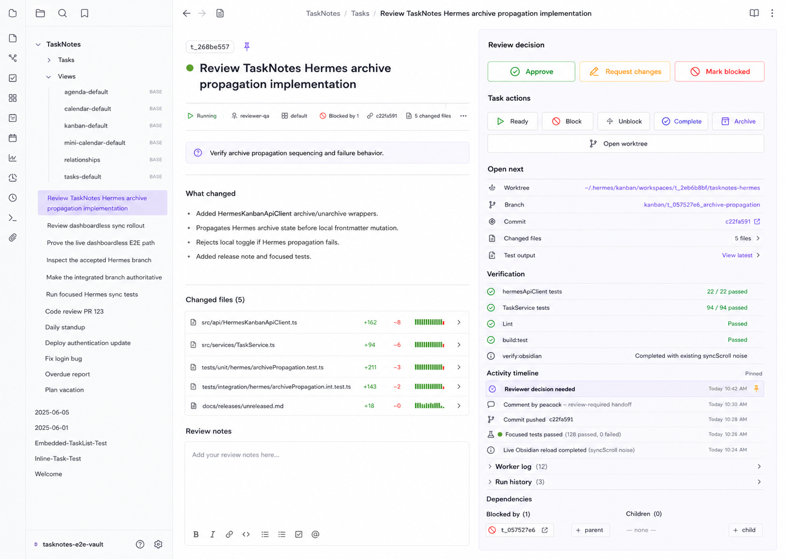

# Hermes Task Note Review Surface PRD

## Summary

Hermes-managed task notes should open as a fast review-and-action surface inside
Obsidian. A reviewer should be able to scan the task, understand the decision
needed, open the right evidence, leave a comment, and approve, block, or request
changes without digging through collapsed properties, raw frontmatter, or a long
activity dump.

This PRD covers the open TaskNotes task note surface. It does not replace the
TaskNotes edit modal or the Hermes dashboard.

## Selected Mockups

### Selected Target: Split Review Sheet With Comment Composer

This is the implementation target. The left side keeps the readable task brief,
changed files, and a compact chat-style comment composer. The right rail holds
review decisions, operational actions, open-next links, verification, activity
timeline, and dependencies.

### Earlier Hybrid: Split Review Sheet With Notes Editor

This earlier mock captures the desired split/evidence hierarchy, but the large
review notes editor should be replaced with the compact comments box shown
above.

## Problem

The current open task note makes review work too slow:

- Obsidian Properties expose many raw fields before the actual task signal.
- The embedded TaskNotes card is useful but too compact for a review workflow.
- Hermes task identity, assignee, board, blocker, branch, worktree, commit,
  changed files, and verification are spread across properties and note body.
- Activity is available, but it is not presented as a prioritized evidence
  timeline.
- Reviewers lack a clear decision surface for approve, request changes, block,
  and comment.

## Goals

- Keep the open note native to Obsidian and TaskNotes.
- Make the first screen answer:
  - What is this task?
  - Who owns it?
  - What decision is needed?
  - What changed?
  - What should I open next?
  - What verification and activity evidence exists?
  - How do I comment or act?
- Preserve the root task note as a compact, readable index into richer activity.
- Fold the evidence timeline into the review rail instead of making activity the
  entire page.
- Use Hermes dashboard drawer patterns where they help: task id, state dot,
  compact metadata rows, action buttons, dependency chips, and operational
  activity sections.
- Keep non-Hermes task notes unchanged.

## Non-Goals

- Rebuilding the Hermes dashboard inside Obsidian.
- Replacing the TaskNotes edit modal.
- Rendering raw JSON as the default activity view.
- Storing large run, event, or comment payloads on the root task note.
- Introducing a dark Hermes visual theme into the Obsidian note surface.
- Making every section a card or adding a marketing-style dashboard layout.

## Users

| User | Need |
| --- | --- |
| Reviewer | Quickly inspect evidence, leave a comment, and approve, block, or request changes. |
| Operator | See board, assignee, status, blockers, branch, worktree, commit, and verification in one place. |
| Agent dispatcher | Keep TaskNotes as the native task surface while Hermes remains the execution runtime. |
| TaskNotes user | Open ordinary task notes without new Hermes-only clutter. |

## Product Principles

- TaskNotes owns task state.
- Hermes owns execution evidence.
- The note should feel like Obsidian, not a web dashboard.
- The first visible surface should be action-oriented.
- Comments are the human review input, not a separate notes editor.
- Activity should be summarized first, with raw detail available on demand.
- Dependencies should use native TaskNotes relationship affordances wherever
  possible.

## UX Requirements

### 1. Header

For Hermes-managed task notes, render a review header near the top of the note,
above the ordinary note body.

Required content:

- Hermes task id, for example `t_268be557`.
- Status dot.
- Task title.
- Summary chips or metadata row:
  - status.
  - assignee.
  - board.
  - blocked-by count.
  - commit if available.
  - changed-file count if available.
- One-line reviewer question or task intent.

The header should use Obsidian spacing, small icons, thin dividers, and current
TaskNotes color tokens.

### 2. Main Split

Render the first screen as a two-column split when there is enough horizontal
space.

Left column:

- reviewer question.
- `What changed` summary.
- changed-file rows.
- comments section with recent comment preview and composer.
- normal task body below or behind a collapsible `Details` section when the
  generated review surface already summarizes it.

Right rail:

- decision buttons.
- task actions.
- open-next links.
- verification rows.
- activity timeline.
- worker log and run history collapsed rows.
- dependency chips.

At narrow widths, stack the rail below the summary and keep the decision group
near the top.

### 3. Decision Group

The decision group is the primary action surface.

Required actions:

- Approve.
- Request changes.
- Mark blocked.

Open questions for implementation:

- Whether `Approve` maps to a Hermes status transition, a comment plus status
  transition, or a TaskNotes status update.
- Whether `Request changes` should require a comment before submitting.

Acceptance expectation:

- Buttons must never be dead. If the backing action is unavailable, disable the
  button with clear tooltip copy.

### 4. Task Actions

Use dashboard-inspired operational actions, translated into Obsidian-native
styling:

- Ready.
- Block.
- Complete.
- Archive.
- Open worktree.

Only render actions that can be safely backed by existing TaskNotes or Hermes
write paths. Disabled states must explain why, especially when Hermes is
disconnected or cache-only.

### 5. Open Next

Render concise rows for the highest-value review targets:

- Worktree.
- Branch.
- Commit.
- Changed files.
- Test output.

Rows should use file/git/link icons, label, value, and a small open affordance.
Long paths should truncate from the middle or start while preserving the useful
tail.

### 6. Verification

Show verification as scannable rows:

- check name.
- state icon.
- result text.
- optional secondary note.

Examples:

- `hermesApiClient tests` -> `22 / 22 passed`.
- `TaskService tests` -> `94 / 94 passed`.
- `lint` -> `Passed`.
- `build:test` -> `Passed`.
- `verify:obsidian` -> `Completed with existing syncScroll noise`.

Verification source can be inferred from structured comments, run metadata,
event payloads, or linked activity notes. If confidence is low, show
`Not verified` rather than guessing.

### 7. Activity Timeline

Fold the evidence timeline into the right rail below verification.

Default visible rows:

- pinned reviewer decision needed row.
- latest meaningful handoff/comment.
- commit pushed.
- focused tests passed.
- live Obsidian reload completed.

Hide noisy events by default:

- heartbeat.
- repeated status churn.
- raw JSON-only payloads without a display summary.

Worker log and run history should be collapsed by default, with counts visible.

### 8. Comments

Replace the left-column review notes editor with a simple comments box.

Requirements:

- Show one or more recent comments as chat-like rows.
- Show author, label, time, and a short body preview.
- Provide a compact composer with placeholder text such as
  `Add a review comment...`.
- Provide a send icon or button inside the composer.
- Support keyboard submit where existing TaskNotes/Hermes comment flows allow it.
- Disable the composer when live comment submission is unavailable, with clear
  copy.

The composer should feel closer to the Hermes dashboard `Add a comment` input
than a large markdown details editor.

### 9. Dependencies

Show dependencies as compact chips in the right rail:

- `Blocked by (N)`.
- `Children (N)`.
- task id chips with open affordances.

Prefer native TaskNotes dependency data and existing relationship widgets over
parallel Hermes-only dependency fields.

## Data Sources

Use existing TaskNotes and Hermes data sources before adding new contracts:

- TaskNotes task info and frontmatter for title, status, priority, projects,
  contexts, assignee, details, and dependencies.
- Hermes identity from the existing Hermes task identity helper.
- Hermes Kanban API detail when live data is available.
- Cached linked activity indexes for comments, runs, events, artifacts, changed
  files, and raw payload notes.
- Existing artifact opening helper for worktree, branch, commit, changed files,
  test output, and raw detail links.

## Implementation Notes

- Scope rendering to Hermes-managed task notes only.
- Keep ordinary TaskNotes notes and non-Hermes task cards unchanged.
- Prefer adding a dedicated note review widget or replacing the current
  Hermes-specific task-card note widget behavior over adding more raw
  frontmatter fields.
- Reuse TaskNotes CSS variables, task-card typography, status dots, metadata
  pills, and modal/action button patterns.
- Keep selectors scoped under `.tasknotes-plugin`.
- Avoid nested cards. Use grouped rows, separators, and a single subtle right
  rail surface.
- Preserve accessibility:
  - keyboard focus for all actions.
  - button labels and tooltips.
  - disabled states with reasons.
  - readable text contrast in light and dark Obsidian themes.

## Acceptance Criteria

- Opening a Hermes-managed task note shows the review header and split review
  surface without expanding Obsidian Properties.
- The selected mockup hierarchy is recognizable in the implemented UI.
- The left column uses `Comments` with a compact composer, not a large review
  notes editor.
- Review decision actions are visible, keyboard reachable, and either functional
  or disabled with explanatory tooltip copy.
- Open-next rows open or focus the correct worktree, branch, commit, changed
  files, and test output surfaces when available.
- Verification rows render from structured or cached evidence and avoid
  invented pass/fail states.
- Activity timeline shows high-signal rows and keeps worker log/run history
  collapsed by default.
- Dependency chips open related tasks or focus the relationships area.
- Non-Hermes task notes render as before.
- The UI remains readable at common desktop widths and stacks cleanly in a
  narrow note pane.

## Suggested Verification

- Focused tests for Hermes-managed task-note rendering, empty/missing data,
  disabled live actions, comments composer, and non-Hermes fallback.
- `npm run typecheck`.
- `npm run build:test`.
- `npm run verify:obsidian`.
- Live Obsidian screenshot check for:
  - light theme.
  - dark theme if feasible.
  - wide note pane.
  - narrow note pane.

## Open Questions

- Should `Approve` set status to done, add an approval comment, unblock a parent,
  or prompt for an explicit transition?
- Should `Request changes` always require a comment?
- Should the review surface be configurable in Modal Fields / note widget
  settings, or always visible for Hermes-managed task notes?
- Should commit and changed-file rows integrate with local git tooling or only
  open stored artifact paths?
