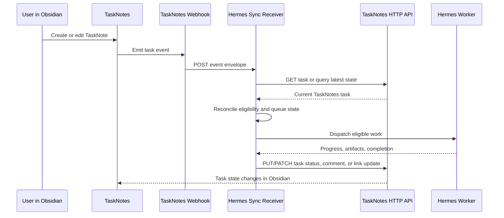

# Hermes TaskNotes API and Webhook Sync PRD

## Summary

Hermes should integrate with TaskNotes through the public TaskNotes HTTP API and
TaskNotes webhooks instead of through a Hermes dashboard, generated dashboard
views, or direct markdown mutation.

TaskNotes remains the native Obsidian control surface for task notes, boards,
Bases, Kanban views, task metadata, dependencies, and user edits. Hermes becomes
a local execution runtime that discovers TaskNotes tasks through the HTTP API,
uses webhooks only as wake-up signals, reconciles its queue from authoritative
API reads, and writes accepted task-facing updates back through the TaskNotes API.

The core contract is:

- Task mirrors live at `TaskNotes/Tasks/<hermesBoard>--<task-id>.md`.
- Activity notes live under `TaskNotes/Activity/<hermesBoard>--<task-id>/`.
- `hermesBoard` and `hermesTaskId` remain explicit frontmatter fields and filter
  fields for Bases, TaskNotes queries, migration, and safe cross-board identity.
- Webhooks are wake-up signals, not the source of truth.
- The TaskNotes HTTP API is the authoritative read/write boundary.
- Periodic reconciliation recovers missed webhooks, restarts, and delivery gaps.
- Hermes does not directly mutate TaskNotes markdown files in the replacement
  architecture.

## Background

The earlier Hermes control-layer direction relied on dashboard-backed mirror
sync and local paths that were easy to confuse with user-authored TaskNotes. That
made the boundary between TaskNotes and Hermes ambiguous:

- TaskNotes and Hermes could both appear to own task fields.
- Mirror notes became both user-facing notes and integration protocol state.
- TaskNotes plugin code needed special knowledge of Hermes dashboard runtime
  behavior.
- Offline, cache-only, and degraded modes were hard to explain.
- The user had to understand whether a task was local, mirrored, dashboard-owned,
  or Hermes-owned.

TaskNotes now has the primitives needed for a cleaner dashboardless boundary:

- The HTTP API can create, query, read, update, archive, and delete tasks.
- Webhooks can notify Hermes when TaskNotes task events occur.
- Canonical board-qualified paths and fields can identify Hermes-backed tasks
  without relying on folder-per-board path contracts.

This PRD pivots Hermes to those primitives.

## Problem

Hermes needs to discover and act on TaskNotes board work, but the integration
should not require a Hermes dashboard as the synchronization authority, direct
Hermes writes to markdown files, or a path contract where the board is inferred
from `TaskNotes/<board>/<task-id>.md`.

Users need one reliable task surface in Obsidian. Agents need one reliable way to
consume and update that work. The integration needs to handle duplicate
notifications, missed notifications, restarts, stale local services, and partial
runtime failures without creating hidden divergent state.

## Goals

- Use TaskNotes task files and TaskNotes views as the user-facing task surface.
- Use the TaskNotes HTTP API for all Hermes discovery, reads, and writeback.
- Use TaskNotes webhooks to trigger low-latency Hermes reconciliation.
- Preserve the current board-qualified identity scheme:

    ```text
    Task mirror:    TaskNotes/Tasks/<hermesBoard>--<task-id>.md
    Activity notes: TaskNotes/Activity/<hermesBoard>--<task-id>/
    Fields:         hermesBoard: <board>, hermesTaskId: <task-id>
    ```

- Keep Hermes execution state, run logs, artifacts, worker policy, leases, and
  reconciliation cursors in Hermes.
- Let Hermes write concise task-facing updates back into TaskNotes only through
  TaskNotes API fields, actions, comments, or configured user fields.
- Make missed webhook recovery automatic through periodic reconciliation.
- Avoid direct Hermes writes to markdown task files in the replacement path.
- Keep the legacy dashboard/mirror sync available only as a gated fallback until
  the API/webhook replacement is proven.

## Non-Goals

- Rebuilding the Hermes dashboard inside TaskNotes.
- Using the Hermes dashboard as the normal TaskNotes sync dependency.
- Making TaskNotes responsible for worker scheduling or execution policy.
- Using webhooks as a durable event log.
- Implementing offline divergent edits and later merge conflict resolution.
- Requiring TaskNotes plugin code to call Hermes-specific APIs for ordinary task
  state.
- Storing full Hermes run history or raw runtime payloads in task frontmatter.
- Reviving the obsolete `TaskNotes/<board>/<task-id>.md` path contract as a
  primary identity model.
- Reintroducing snake_case legacy identity fields as the primary contract.

## Users

| User              | Need                                                                                            |
| ----------------- | ----------------------------------------------------------------------------------------------- |
| Obsidian operator | Manage personal and agent-runnable work from normal TaskNotes surfaces.                         |
| Hermes dispatcher | Discover eligible work and keep its queue in sync with TaskNotes.                               |
| Hermes worker     | Claim runnable work, execute it, and report progress or completion.                             |
| Reviewer          | See concise task status, comments, links, and artifacts without opening Hermes for every check. |

## Product Principles

- TaskNotes owns task state.
- Hermes owns execution state.
- Public APIs beat dashboard or plugin-internal coupling.
- Webhooks should reduce latency, not replace reconciliation.
- HTTP API reads are authoritative after every webhook.
- Every Hermes write must be idempotent or safely repeatable.
- Board identity must be explicit and board-qualified in both path and fields.
- A task should be understandable by reading the note and its TaskNotes fields.
- If Hermes is down, TaskNotes remains useful for human task management.

## System Of Record

| Domain                                                                                                      | System of record                         | Notes                                                                                         |
| ----------------------------------------------------------------------------------------------------------- | ---------------------------------------- | --------------------------------------------------------------------------------------------- |
| Task title, details, status, priority, schedule, due date, tags, contexts, projects, dependencies, assignee | TaskNotes                                | Stored in TaskNotes markdown and edited through TaskNotes surfaces or HTTP API.               |
| Hermes task identity                                                                                        | TaskNotes + Hermes                       | Canonical tuple is `(hermesBoard, hermesTaskId)`, mirrored in fields and board-qualified path. |
| Task mirror path                                                                                            | TaskNotes path                           | Canonical path is `TaskNotes/Tasks/<hermesBoard>--<task-id>.md`.                              |
| Activity note path                                                                                          | TaskNotes path                           | Canonical root is `TaskNotes/Activity/<hermesBoard>--<task-id>/`.                             |
| Worker eligibility                                                                                          | Hermes policy over TaskNotes API fields  | Hermes reads TaskNotes fields and decides whether a task is runnable.                         |
| Execution runs, logs, worker sessions, long artifacts                                                       | Hermes                                   | TaskNotes may hold concise links or summaries.                                                |
| Sync cursor, delivery dedupe, last reconciled task snapshot                                                 | Hermes                                   | Internal integration state, not TaskNotes task frontmatter.                                   |
| Webhook configuration                                                                                       | TaskNotes settings/API plus Hermes setup | TaskNotes sends events; Hermes owns receiver availability and signature validation.           |

## Board-Qualified Identity Model

The replacement architecture identifies a Hermes-backed TaskNote by an explicit
board-qualified tuple, not by an unqualified task id and not by a board folder.

Canonical task mirror path:

```text
TaskNotes/Tasks/developer--t_b08af626.md
```

Canonical activity root:

```text
TaskNotes/Activity/developer--t_b08af626/
```

Required frontmatter/filter fields:

```yaml
hermesBoard: developer
hermesTaskId: t_b08af626
```

Derived identity:

```json
{
	"hermesBoard": "developer",
	"hermesTaskId": "t_b08af626",
	"taskPath": "TaskNotes/Tasks/developer--t_b08af626.md",
	"activityRoot": "TaskNotes/Activity/developer--t_b08af626/"
}
```

Requirements:

- `(hermesBoard, hermesTaskId)` is the stable cross-system identity.
- The task mirror filename must include both board and task id, separated by
  `--`, so two boards can safely contain the same Hermes task id.
- `hermesBoard` and `hermesTaskId` remain first-class frontmatter fields because
  TaskNotes Bases, filters, migrations, and API queries should not need to parse
  filenames.
- Activity notes for comments, runs, events, artifacts, and changed files live
  below the board-qualified activity root.
- Legacy aliases such as `hermes_board` and `hermes_id` may be read during
  migration, but new writes use camelCase fields.
- The old `TaskNotes/<board>/<task-id>.md` layout is legacy-only and must not be
  used as the replacement contract.

## Task Eligibility

Hermes should treat TaskNotes as a broad task universe and select eligible work
through explicit API filters.

MVP eligibility rules:

- The task is under the configured TaskNotes tasks folder, normally
  `TaskNotes/Tasks/`.
- The task has `type: task` or the TaskNotes API marks it as a task.
- The task has `hermesBoard` and `hermesTaskId` fields, or it matches a configured
  non-Hermes TaskNotes scope that Hermes is allowed to import/create from.
- The task belongs to a configured Hermes board, project, context, tag, or other
  TaskNotes query scope.
- The task is not archived.
- The task status is in a configured runnable or visible status set.
- The assignee is either an agent, a human, or blank according to Hermes routing
  policy.

Suggested conventions:

```yaml
hermesBoard: developer
hermesTaskId: t_b08af626
projects:
    - Hermes/developer
contexts:
    - hermes
assignee: peacock
```

The MVP should prefer `hermesBoard` field filters over folder-derived identity.
Folder/path checks are guardrails for canonical placement, not the primary board
source.

## Integration Architecture



Key responsibilities:

- TaskNotes stores and presents task notes.
- TaskNotes emits webhooks for task lifecycle changes.
- Hermes receives webhooks and treats them as queue invalidation/wake-up signals.
- Hermes immediately reads current state from the TaskNotes HTTP API before queue
  changes.
- Hermes periodically reconciles configured TaskNotes scopes through the HTTP API
  even when no webhook arrives.
- Hermes writes task-facing changes back through the TaskNotes HTTP API.
- Hermes never treats a webhook payload or local markdown file read as more
  authoritative than an HTTP API read.

## Webhook Handling

Hermes should register a webhook for:

- `task.created`
- `task.updated`
- `task.deleted`
- `task.completed`
- `task.archived`
- `task.unarchived`

Optional later subscriptions:

- `time.started`
- `time.stopped`
- `pomodoro.started`
- `pomodoro.completed`
- `reminder.triggered`

Webhook handler requirements:

- Verify `X-TaskNotes-Signature` when a secret is configured.
- Use `X-TaskNotes-Delivery-ID` for delivery dedupe.
- Accept duplicate deliveries safely.
- Return success only after the event is durably queued or processed.
- Treat payload task data as a hint, not the final state.
- Fetch the current task through the HTTP API before making queue decisions.
- Reconcile by `(hermesBoard, hermesTaskId)` when those fields are present.
- For delete events, remove or tombstone the matching Hermes queue item.
- For archive and completed events, stop or close active execution according to
  Hermes policy.

Because TaskNotes webhooks are asynchronous and can retry, Hermes must not assume
strict ordering.

## HTTP API Usage

Hermes should use these TaskNotes HTTP API capabilities:

| Need                                  | Endpoint                                                              |
| ------------------------------------- | --------------------------------------------------------------------- |
| Health check                          | `GET /api/health`                                                     |
| List recent tasks                     | `GET /api/tasks`                                                      |
| Query eligible board tasks            | `POST /api/tasks/query`                                               |
| Read one task                         | `GET /api/tasks/:id`                                                  |
| Create a task from Hermes, if allowed | `POST /api/tasks`                                                     |
| Update accepted task fields           | `PUT /api/tasks/:id` or supported partial-update endpoint             |
| Archive a task                        | `POST /api/tasks/:id/archive`                                         |
| Delete a task, if policy allows       | `DELETE /api/tasks/:id`                                               |
| Register/list/delete webhook          | `POST /api/webhooks`, `GET /api/webhooks`, `DELETE /api/webhooks/:id` |
| Inspect delivery health               | `GET /api/webhooks/deliveries`                                        |

For filtered scans, Hermes should use `POST /api/tasks/query`, not filtered query
params on `GET /api/tasks`.

Example board query shape:

```json
{
	"type": "group",
	"id": "hermes-board-root",
	"conjunction": "and",
	"children": [
		{
			"type": "condition",
			"id": "not-archived",
			"property": "archived",
			"operator": "is-not-checked"
		},
		{
			"type": "condition",
			"id": "hermes-board",
			"property": "hermesBoard",
			"operator": "is",
			"value": "developer"
		},
		{
			"type": "condition",
			"id": "has-hermes-task-id",
			"property": "hermesTaskId",
			"operator": "is-not-empty"
		}
	],
	"sortKey": "dateModified",
	"sortDirection": "desc"
}
```

## Create Flow

### User Creates In TaskNotes

1. User creates a task in TaskNotes.
2. TaskNotes writes the markdown task through normal TaskNotes behavior.
3. TaskNotes emits `task.created`.
4. Hermes receives the webhook and fetches the current task through the HTTP API.
5. Hermes evaluates eligibility from the authoritative API task.
6. If eligible, Hermes creates or updates its internal queue item keyed by
   `(hermesBoard, hermesTaskId)` or by a configured import identity.
7. If runnable, Hermes schedules work according to policy.

### Hermes Creates In TaskNotes

Hermes-created tasks are allowed only when Hermes is acting as an API client of
TaskNotes, not when trying to bypass TaskNotes storage.

1. Hermes calls `POST /api/tasks` with TaskNotes-compatible fields, including
   `hermesBoard` and `hermesTaskId` when the task is already known to Hermes.
2. TaskNotes creates the task and returns the accepted task.
3. Hermes stores the returned API task id/path plus the board-qualified identity.
4. TaskNotes emits `task.created`.
5. Hermes handles the webhook idempotently; if the returned task was already
   recorded, the webhook should become a no-op or refresh.

Hermes should provide an idempotency key in a TaskNotes-compatible custom field
only if TaskNotes supports that field in the user's configuration. Otherwise,
Hermes should dedupe locally by request fingerprint and returned API task.

## Update Flow

### User Updates In TaskNotes

1. User edits title, details, status, priority, assignee, due date, schedule,
   dependencies, project, context, tags, or Hermes routing fields.
2. TaskNotes emits `task.updated`, `task.completed`, `task.archived`, or
   `task.unarchived`.
3. Hermes fetches the current task through the HTTP API.
4. Hermes compares the task with its last reconciled snapshot.
5. Hermes updates queue state, worker eligibility, or active execution.

### Hermes Updates TaskNotes

Hermes writes to TaskNotes through `PUT /api/tasks/:id` or specific task action
endpoints. Hermes must not patch the markdown file directly.

Allowed MVP writes:

- Status changes such as `running`, `review`, `blocked`, `done`.
- Assignee updates when Hermes routing explicitly changes ownership.
- Priority updates when policy or user action asks Hermes to reroute work.
- Dependency updates through TaskNotes-supported dependency fields.
- Concise comments or details updates when TaskNotes supports the intended field
  through the API.
- Artifact links or summary fields if configured as TaskNotes user fields.
- `hermesBoard` and `hermesTaskId` only when creating, migrating, or repairing a
  Hermes-backed task through the API.

Hermes should not write raw run logs, large JSON payloads, or internal worker
state into frontmatter.

## Activity Notes

Activity notes provide an Obsidian-readable cache/index of Hermes-facing activity
without making markdown mutation the sync protocol.

Canonical root:

```text
TaskNotes/Activity/<hermesBoard>--<task-id>/
```

Recommended subfolders:

- `comments/`
- `runs/`
- `events/`
- `artifacts/`

Activity requirements:

- Activity notes use the same `hermesBoard` and `hermesTaskId` fields as the task
  mirror.
- Activity links on the task note should be written through TaskNotes-supported
  API fields or actions when exposed.
- Raw Hermes runtime payloads stay in Hermes unless a specific artifact is meant
  to be user-visible.
- Legacy unqualified activity roots may be inventoried and backfilled
  non-destructively, but new activity belongs under the board-qualified root.

## Execution Updates

Hermes should keep detailed execution records in Hermes and write only task-level
summaries back to TaskNotes.

Recommended TaskNotes-facing updates:

- `status: running` when a worker starts accepted work.
- `status: review` when work needs user review.
- `status: blocked` when Hermes cannot proceed and the blocker is useful to the
  user.
- `status: done` when work is completed and no review is required.
- A short latest activity summary in a configured user field, if available.
- Artifact links in a configured user field, task details section, or comment
  channel, depending on TaskNotes API support.

Detailed run history remains in Hermes and can be opened from links.

## Reconciliation

Hermes must run periodic reconciliation in addition to webhook handling.

Minimum reconciliation loop:

1. Check `GET /api/health`.
2. Query configured eligible TaskNotes scopes with `POST /api/tasks/query`.
3. Compare returned tasks with Hermes queue state by `(hermesBoard,
   hermesTaskId)` and API task id/path.
4. Add missing eligible tasks.
5. Update changed tasks.
6. Tombstone tasks no longer present, archived, completed, or no longer eligible.
7. Record a successful reconciliation timestamp.

Suggested cadence:

- Fast loop while both Obsidian and Hermes are active: every 30 to 60 seconds.
- Slow loop when idle or degraded: every 5 to 15 minutes.
- Immediate reconciliation after each accepted webhook.

Hermes should expose sync health:

- Last webhook received.
- Last webhook processed.
- Last full reconciliation.
- Last TaskNotes API health status.
- Number of queued delivery failures or signature failures.
- Number of eligible tasks and runnable tasks.

## Conflict Handling

The MVP avoids offline merge logic.

Conflict rules:

- TaskNotes task state wins for fields owned by TaskNotes.
- Hermes execution state wins for fields owned by Hermes.
- A Hermes write should be based on the latest fetched TaskNotes task.
- If Hermes sees the task changed since its last read, it should refetch and
  re-evaluate before writing.
- If a user changes `hermesBoard` or `hermesTaskId`, Hermes should treat that as
  a high-risk identity change and require an API-supported move/repair policy
  rather than guessing.
- If a user moves a task out of an eligible scope or removes its eligibility
  marker, Hermes should stop treating it as runnable.
- If a user archives or completes an active task, Hermes should stop or close
  execution according to policy.
- If Hermes cannot safely apply a write, it should record a Hermes-side sync
  error and avoid overwriting user changes.

## Security

MVP requirements:

- TaskNotes HTTP API should use an auth token for Hermes workflows.
- Hermes stores the API token outside task notes.
- Webhooks use a secret and signature verification.
- Hermes binds its webhook receiver to loopback by default.
- Hermes should reject webhook payloads from unexpected vaults when a vault path
  allowlist is configured.
- Hermes should not expose the TaskNotes API token in logs, comments, artifacts,
  or task fields.

## Availability And Degraded Mode

TaskNotes must remain useful when Hermes is unavailable.

If Hermes is down:

- Users can continue creating and editing TaskNotes tasks.
- Webhook deliveries may fail and retry according to TaskNotes behavior.
- Full reconciliation catches up when Hermes returns.
- TaskNotes does not need a Hermes dashboard to keep local task editing useful.

If TaskNotes HTTP API is down:

- Hermes pauses TaskNotes-backed queue reconciliation.
- Hermes should not mutate markdown files directly.
- Active Hermes runs may continue only if their policy allows work from the last
  known snapshot.
- Hermes should mark TaskNotes sync as degraded and retry health checks.

If webhooks are disabled or auto-disabled:

- Hermes continues periodic reconciliation.
- Hermes surfaces that low-latency sync is degraded.
- Setup tooling can recreate or re-enable the webhook through the HTTP API.

## User Experience

TaskNotes UI should not need a Hermes-specific dashboard model.

Recommended UX:

- Users manage work in ordinary TaskNotes boards, Bases, modals, and properties.
- Agent-runnable work is expressed through normal fields such as board, project,
  tag, status, priority, and assignee, plus `hermesBoard`/`hermesTaskId` for
  Hermes-backed tasks.
- If Hermes is connected, TaskNotes may show optional sync/runtime indicators.
- If Hermes is unavailable, TaskNotes should not block normal task editing.
- Links to Hermes run details or artifacts can appear as ordinary task links or
  configured user fields.

Avoid:

- Empty Hermes-only modal groups.
- Required dashboard availability for normal task edits.
- Local-only edits that pretend to update Hermes execution state.
- Raw JSON activity dumps in task body or frontmatter.
- Inferring board identity from an obsolete folder layout when canonical fields
  are present.

## Configuration

TaskNotes settings:

- Enable HTTP API.
- Set an API auth token.
- Register Hermes webhook URL.
- Subscribe Hermes webhook to task lifecycle events.
- Optionally configure user fields for latest Hermes summary, artifacts, or sync
  status.
- Preserve `hermesBoard` and `hermesTaskId` as visible/filterable fields where
  Hermes-backed board views need them.

Hermes settings:

- TaskNotes base URL, default `http://127.0.0.1:8080`.
- TaskNotes API token.
- Webhook secret.
- Vault allowlist.
- Eligible Hermes boards, projects, contexts, tags, or TaskNotes query scopes.
- Runnable statuses.
- Human assignee values.
- Agent assignee values.
- Reconciliation cadence.
- Policy for active runs when TaskNotes API is unavailable.
- Feature flag for the legacy dashboard/mirror fallback.

## Rollout And Fallback

Rollout should prove the dashboardless path before removing legacy sync.

1. Add the TaskNotes API/webhook integration behind a feature flag.
2. Register the Hermes webhook and verify delivery health through the TaskNotes
   webhook delivery API.
3. Run read-only reconciliation first: query TaskNotes tasks, map identities by
   `(hermesBoard, hermesTaskId)`, and compare against existing Hermes queue state
   without writes.
4. Enable API writeback for low-risk status/comment/link updates after read-only
   reconciliation is stable.
5. Backfill or repair canonical board-qualified paths and fields through
   TaskNotes-supported APIs or explicit migration tooling.
6. Keep the legacy dashboard/mirror sync as a gated fallback for recovery only.
7. Disable the fallback by default once webhook delivery, periodic
   reconciliation, and API writeback have been proven in normal use.

Fallback rules:

- The fallback must be opt-in or operator-gated, not silently selected.
- The fallback must be labeled legacy in docs, settings, and logs.
- The fallback must not reintroduce the obsolete `TaskNotes/<board>/<task-id>.md`
  contract as the source of truth.
- Fallback use should emit diagnostics so any remaining replacement-path gaps can
  be fixed.

## MVP Acceptance Criteria

- The PRD and implementation no longer rely on the obsolete
  `TaskNotes/<board>/<task-id>.md` path contract.
- Hermes can register or verify a TaskNotes webhook through the HTTP API.
- Hermes receives `task.created` and reconciles the current task by reading it
  through the HTTP API.
- Hermes receives `task.updated` and updates queue eligibility from the latest
  HTTP API state.
- Hermes treats webhook payloads as hints and HTTP API reads as authoritative.
- Hermes handles duplicate webhook deliveries without duplicate queue items or
  duplicate worker runs.
- Hermes recovers from missed webhook deliveries through periodic full
  reconciliation.
- Hermes updates task status through `PUT /api/tasks/:id` or a specific
  TaskNotes task action endpoint.
- Hermes does not directly mutate TaskNotes markdown files in the replacement
  architecture.
- Task mirrors use `TaskNotes/Tasks/<hermesBoard>--<task-id>.md`.
- Activity notes use `TaskNotes/Activity/<hermesBoard>--<task-id>/`.
- `hermesBoard` and `hermesTaskId` remain frontmatter/filter fields.
- The legacy dashboard/mirror sync path is either disabled by default or clearly
  marked as a gated fallback.
- Focused tests cover webhook dedupe, API pull-after-webhook, reconciliation,
  board-qualified identity, and writeback through TaskNotes HTTP API.

## Implementation Plan

### Phase 1: Contract And Setup

- Document the integration contract in TaskNotes and Hermes docs.
- Add Hermes setup code to register/list/delete its TaskNotes webhook.
- Store TaskNotes API token and webhook secret in Hermes configuration.
- Add health checks for TaskNotes HTTP API and webhook receiver state.
- Ensure TaskNotes queries can filter on `hermesBoard` and `hermesTaskId`.

### Phase 2: Webhook Receiver

- Implement Hermes webhook endpoint.
- Verify signatures.
- Dedupe delivery IDs.
- Persist incoming events before processing or process them transactionally.
- Fetch latest task state through TaskNotes HTTP API before queue changes.

### Phase 3: Reconciliation Engine

- Implement configured TaskNotes task queries.
- Reconcile queue state by `(hermesBoard, hermesTaskId)` plus API task id/path.
- Build queue state from TaskNotes API tasks.
- Add periodic full reconciliation and health reporting.

### Phase 4: Execution Writeback

- Write execution status updates through TaskNotes HTTP API.
- Add concise artifact or activity summaries through configured fields.
- Ensure writes are idempotent and based on the latest fetched task.
- Add conflict guards for archived, completed, moved, identity-edited, or
  no-longer-eligible tasks.

### Phase 5: Retire Legacy Coupling

- Remove or disable dashboard-dependent TaskNotes sync code from the normal path.
- Keep any useful TaskNotes UI affordances that operate on TaskNotes fields.
- Mark direct mirror-note sync as legacy fallback only.
- Update release notes and migration notes for users of the old bridge.

## Open Questions

- Should Hermes-created tasks be allowed in the MVP, or should all new work be
  created from TaskNotes first?
- Which TaskNotes field should hold artifact links, if any?
- Should comments be modeled through task details, a user field, or a future
  TaskNotes comments API?
- Should the default eligibility marker be `hermesBoard`, project, context, tag,
  or a combination?
- What should Hermes do with an active run when the user changes assignee from an
  agent to a human?
- What status should Hermes use for review-required work: `review`,
  `needs-review`, or a configurable value?
- How much Hermes sync health should appear in TaskNotes versus only in Hermes?
- What TaskNotes API shape is needed for safe board move/identity repair of an
  existing Hermes-backed task?
