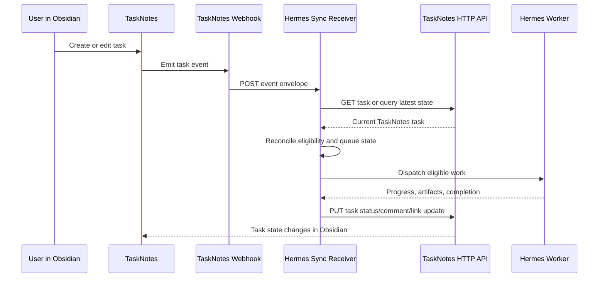

# Hermes TaskNotes API and Webhook Sync PRD

## Summary

Hermes should integrate with TaskNotes through the public TaskNotes HTTP API and
TaskNotes webhooks instead of relying on a bespoke mirror-note sync layer inside
TaskNotes.

TaskNotes remains the native Obsidian control surface for tasks, boards, Bases,
Kanban views, task metadata, dependencies, and user edits. Hermes becomes a
local execution and runtime system that watches TaskNotes task changes, pulls
current task state through the HTTP API, decides which work is runnable, and
writes accepted execution updates back through the same API.

The core rule is:

- Webhooks are wake-up signals.
- The HTTP API is the authoritative integration read/write path.
- Markdown files remain TaskNotes-owned task storage, not a private Hermes sync
  protocol.

## Background

The previous Hermes control-layer direction tried to make TaskNotes act as the
live frontend for Hermes Kanban, with TaskNotes calling Hermes APIs directly and
refreshing local mirror notes after accepted Hermes mutations.

That solved some UI problems but created a confusing ownership model:

- TaskNotes and Hermes could both appear to own task fields.
- Mirror notes became both user-facing notes and integration protocol state.
- TaskNotes plugin code had to know Hermes-specific runtime behavior.
- Offline and degraded modes were hard to explain without inventing a second
  sync model.
- The user had to understand whether a task was local, mirrored, or Hermes-owned.

TaskNotes already exposes the two primitives needed for a cleaner boundary:

- The HTTP API can create, query, read, update, archive, and delete tasks.
- Webhooks can notify an external service when task events occur.

This PRD pivots Hermes to those primitives.

## Problem

Hermes needs to see and act on TaskNotes board work, but the integration should
not make TaskNotes a Hermes-specific plugin fork or require direct markdown file
mutation by Hermes.

Users need one reliable task surface in Obsidian. Agents need one reliable way
to consume and update that work. The integration needs to handle duplicate
notifications, missed notifications, restarts, stale local services, and partial
runtime failures without creating hidden divergent state.

## Goals

- Use TaskNotes task files and TaskNotes views as the user-facing source of task
  state.
- Use the TaskNotes HTTP API for all Hermes reads and writes.
- Use TaskNotes webhooks to trigger low-latency Hermes reconciliation.
- Preserve the native board-folder identity convention:

    ```text
    TaskNotes/<board>/<task-id>.md
    ```

- Keep Hermes execution state, run logs, artifacts, and worker policy in Hermes.
- Let Hermes write concise task-facing updates back into TaskNotes only when
  they belong in task state or user-visible task history.
- Make missed webhook recovery automatic through periodic reconciliation.
- Avoid direct Hermes writes to markdown task files.

## Non-Goals

- Rebuilding the Hermes dashboard inside TaskNotes.
- Making TaskNotes responsible for worker scheduling or execution policy.
- Using webhooks as a durable event log.
- Implementing offline divergent edits and later merge conflict resolution.
- Requiring TaskNotes plugin code to call Hermes-specific APIs for ordinary
  task state.
- Storing full Hermes run history or raw runtime payloads in task frontmatter.
- Reintroducing legacy Hermes identity fields as the primary contract.

## Users

| User              | Need                                                                                            |
| ----------------- | ----------------------------------------------------------------------------------------------- |
| Obsidian operator | Manage personal and agent-runnable work from normal TaskNotes surfaces.                         |
| Hermes dispatcher | Discover eligible work and keep its queue in sync with TaskNotes.                               |
| Hermes worker     | Claim runnable work, execute it, and report progress or completion.                             |
| Reviewer          | See concise task status, comments, links, and artifacts without opening Hermes for every check. |

## Product Principles

- TaskNotes owns task state.
- Hermes owns execution state.
- Public APIs beat plugin-internal coupling.
- Webhooks should reduce latency, not replace reconciliation.
- Every Hermes write must be idempotent or safely repeatable.
- TaskNotes board folders remain meaningful Obsidian surfaces, not hidden cache
  folders.
- A task should be understandable by reading the note and its TaskNotes fields.
- If Hermes is down, TaskNotes remains useful for human task management.

## System Of Record

| Domain                                                                                                      | System of record                         | Notes                                                                               |
| ----------------------------------------------------------------------------------------------------------- | ---------------------------------------- | ----------------------------------------------------------------------------------- |
| Task title, details, status, priority, schedule, due date, tags, contexts, projects, dependencies, assignee | TaskNotes                                | Stored in TaskNotes markdown and edited through TaskNotes surfaces or HTTP API.     |
| Board identity                                                                                              | TaskNotes path                           | Derived from `TaskNotes/<board>/<task-id>.md`.                                      |
| Worker eligibility                                                                                          | Hermes policy over TaskNotes fields      | Hermes reads TaskNotes fields and decides whether a task is runnable.               |
| Execution runs, logs, worker sessions, long artifacts                                                       | Hermes                                   | TaskNotes may hold concise links or summaries.                                      |
| Sync cursor, delivery dedupe, last reconciled task snapshot                                                 | Hermes                                   | Internal integration state, not TaskNotes task frontmatter.                         |
| Webhook configuration                                                                                       | TaskNotes settings/API plus Hermes setup | TaskNotes sends events; Hermes owns receiver availability and signature validation. |

## Task Eligibility

Hermes should treat TaskNotes as a broad task universe and select eligible work
through explicit filters.

MVP eligibility rules:

- The task path matches `TaskNotes/<board>/<task-id>.md`.
- The task has `type: task`.
- The task belongs to a configured Hermes board folder, project, context, or tag.
- The task is not archived.
- The task status is in a configured runnable or visible status set.
- The assignee is either an agent, a human, or blank according to Hermes routing
  policy.

Suggested conventions:

```yaml
tags:
    - task
    - hermes-kanban
projects:
    - Hermes/hhmi
contexts:
    - hhmi
assignee: codex
```

The MVP should support folder-derived board identity even if the tag or project
is missing, but production setups should prefer explicit filters so ordinary
TaskNotes folders are not accidentally consumed.

## Integration Architecture



## Webhook Handling

Hermes should register a webhook for:

- `task.created`
- `task.updated`
- `task.deleted`
- `task.completed`
- `task.archived`
- `task.unarchived`

Optional later subscriptions:

- `time.started`
- `time.stopped`
- `pomodoro.started`
- `pomodoro.completed`
- `reminder.triggered`

Webhook handler requirements:

- Verify `X-TaskNotes-Signature` when a secret is configured.
- Use `X-TaskNotes-Delivery-ID` for delivery dedupe.
- Accept duplicates safely.
- Return success only after the event is durably queued or processed.
- Treat payload task data as a hint, not the final state.
- Fetch the current task through the HTTP API before making queue decisions.
- For delete events, remove or tombstone the matching Hermes queue item.
- For archive and completed events, stop or close active execution according to
  Hermes policy.

Because TaskNotes webhooks are asynchronous and can retry, Hermes must not assume
strict ordering.

## HTTP API Usage

Hermes should use these TaskNotes HTTP API capabilities:

| Need                                  | Endpoint                                                              |
| ------------------------------------- | --------------------------------------------------------------------- |
| Health check                          | `GET /api/health`                                                     |
| List recent tasks                     | `GET /api/tasks`                                                      |
| Query eligible board tasks            | `POST /api/tasks/query`                                               |
| Read one task by path                 | `GET /api/tasks/:id`                                                  |
| Create a task from Hermes, if allowed | `POST /api/tasks`                                                     |
| Update accepted task fields           | `PUT /api/tasks/:id`                                                  |
| Archive a task                        | `POST /api/tasks/:id/archive`                                         |
| Delete a task, if policy allows       | `DELETE /api/tasks/:id`                                               |
| Register/list/delete webhook          | `POST /api/webhooks`, `GET /api/webhooks`, `DELETE /api/webhooks/:id` |
| Inspect delivery health               | `GET /api/webhooks/deliveries`                                        |

For filtered scans, Hermes should use `POST /api/tasks/query`, not filtered
query params on `GET /api/tasks`.

Example board query shape:

```json
{
	"type": "group",
	"id": "hermes-board-root",
	"conjunction": "and",
	"children": [
		{
			"type": "condition",
			"id": "not-archived",
			"property": "archived",
			"operator": "is-not-checked"
		},
		{
			"type": "condition",
			"id": "project",
			"property": "projects",
			"operator": "contains",
			"value": "Hermes/hhmi"
		}
	],
	"sortKey": "dateModified",
	"sortDirection": "desc"
}
```

## Task Path Identity

Hermes derives task identity from the TaskNotes path:

```text
TaskNotes/hhmi/t_123.md
```

Derived identity:

```json
{
	"board": "hhmi",
	"taskPath": "TaskNotes/hhmi/t_123.md",
	"taskId": "t_123"
}
```

The path is the integration identifier. Hermes should avoid requiring these
legacy fields:

- `hermes_id`
- `hermes_board`
- `sync_origin`
- `sync_hash`
- `last_synced`
- writeback fields

Hermes may keep its own internal mapping from `taskPath` to run IDs, queue IDs,
worker leases, and reconciliation cursors.

## Create Flow

### User Creates In TaskNotes

1. User creates a task in TaskNotes.
2. TaskNotes writes the markdown task through normal TaskNotes behavior.
3. TaskNotes emits `task.created`.
4. Hermes receives the webhook and fetches the current task through the HTTP API.
5. Hermes evaluates eligibility.
6. If eligible, Hermes creates or updates its internal queue item.
7. If runnable, Hermes schedules work according to policy.

### Hermes Creates In TaskNotes

Hermes-created tasks are allowed only when Hermes is acting as a client of
TaskNotes, not when trying to bypass TaskNotes storage.

1. Hermes calls `POST /api/tasks` with TaskNotes-compatible fields.
2. TaskNotes creates the task and returns the accepted task.
3. Hermes stores the returned `taskPath`.
4. TaskNotes emits `task.created`.
5. Hermes handles the webhook idempotently; if the returned task was already
   recorded, the webhook should become a no-op or refresh.

Hermes should provide an idempotency key in a TaskNotes-compatible custom field
only if TaskNotes supports that field in the user's configuration. Otherwise,
Hermes should dedupe locally by request fingerprint and returned task path.

## Update Flow

### User Updates In TaskNotes

1. User edits title, details, status, priority, assignee, due date, schedule,
   dependencies, project, context, or tags.
2. TaskNotes emits `task.updated`, `task.completed`, `task.archived`, or
   `task.unarchived`.
3. Hermes fetches the current task through the HTTP API.
4. Hermes compares the task with its last reconciled snapshot.
5. Hermes updates queue state, worker eligibility, or active execution.

### Hermes Updates TaskNotes

Hermes writes to TaskNotes through `PUT /api/tasks/:id` or specific task action
endpoints.

Allowed MVP writes:

- Status changes such as `running`, `review`, `blocked`, `done`.
- Assignee updates when Hermes routing explicitly changes ownership.
- Priority updates when policy or user action asks Hermes to reroute work.
- Dependency updates through `blockedBy`.
- Concise comments or details updates when TaskNotes supports the intended
  field through the API.
- Artifact links or summary fields if configured as TaskNotes user fields.

Hermes should not write raw run logs, large JSON payloads, or internal worker
state into frontmatter.

## Execution Updates

Hermes should keep detailed execution records in Hermes and write only task-level
summaries back to TaskNotes.

Recommended TaskNotes-facing updates:

- `status: running` when a worker starts accepted work.
- `status: review` when work needs user review.
- `status: blocked` when Hermes cannot proceed and the blocker is useful to the
  user.
- `status: done` when work is completed and no review is required.
- A short latest activity summary in a configured user field, if available.
- Artifact links in a configured user field, task details section, or comment
  channel, depending on TaskNotes API support.

Detailed run history remains in Hermes and can be opened from links.

## Reconciliation

Hermes must run periodic reconciliation in addition to webhook handling.

Minimum reconciliation loop:

1. Check `GET /api/health`.
2. Query configured eligible TaskNotes scopes with `POST /api/tasks/query`.
3. Compare returned tasks with Hermes queue state.
4. Add missing eligible tasks.
5. Update changed tasks.
6. Tombstone tasks no longer present, archived, completed, or no longer eligible.
7. Record a successful reconciliation timestamp.

Suggested cadence:

- Fast loop while both Obsidian and Hermes are active: every 30 to 60 seconds.
- Slow loop when idle or degraded: every 5 to 15 minutes.
- Immediate reconciliation after each accepted webhook.

Hermes should expose sync health:

- Last webhook received.
- Last webhook processed.
- Last full reconciliation.
- Last TaskNotes API health status.
- Number of queued delivery failures or signature failures.
- Number of eligible tasks and runnable tasks.

## Conflict Handling

The MVP avoids offline merge logic.

Conflict rules:

- TaskNotes task state wins for fields owned by TaskNotes.
- Hermes execution state wins for fields owned by Hermes.
- A Hermes write should be based on the latest fetched TaskNotes task.
- If Hermes sees the task changed since its last read, it should refetch and
  re-evaluate before writing.
- If a user moves a task out of an eligible board or removes its eligibility
  marker, Hermes should stop treating it as runnable.
- If a user archives or completes an active task, Hermes should stop or close
  execution according to policy.
- If Hermes cannot safely apply a write, it should record a Hermes-side sync
  error and avoid overwriting user changes.

## Security

MVP requirements:

- TaskNotes HTTP API should use an auth token for Hermes workflows.
- Hermes stores the API token outside task notes.
- Webhooks use a secret and signature verification.
- Hermes binds its webhook receiver to loopback by default.
- Hermes should reject webhook payloads from unexpected vaults when a vault path
  allowlist is configured.
- Hermes should not expose the TaskNotes API token in logs, comments, artifacts,
  or task fields.

## Availability And Degraded Mode

TaskNotes must remain useful when Hermes is unavailable.

If Hermes is down:

- Users can continue creating and editing TaskNotes tasks.
- Webhook deliveries may fail and retry according to TaskNotes behavior.
- Full reconciliation catches up when Hermes returns.

If TaskNotes HTTP API is down:

- Hermes pauses TaskNotes-backed queue reconciliation.
- Hermes should not mutate markdown files directly.
- Active Hermes runs may continue only if their policy allows work from the last
  known snapshot.
- Hermes should mark TaskNotes sync as degraded and retry health checks.

If webhooks are disabled or auto-disabled:

- Hermes continues periodic reconciliation.
- Hermes surfaces that low-latency sync is degraded.
- Setup tooling can recreate or re-enable the webhook through the HTTP API.

## User Experience

TaskNotes UI should not need a Hermes-specific task classification model.

Recommended UX:

- Users manage work in ordinary TaskNotes boards, Bases, modals, and properties.
- Agent-runnable work is expressed through normal fields such as board, project,
  tag, status, priority, and assignee.
- If Hermes is connected, TaskNotes may show optional sync/runtime indicators.
- If Hermes is unavailable, TaskNotes should not block normal task editing.
- Links to Hermes run details or artifacts can appear as ordinary task links or
  configured user fields.

Avoid:

- Empty Hermes-only modal groups.
- Required `hermes_*` frontmatter for new tasks.
- Local-only edits that pretend to update Hermes execution state.
- Raw JSON activity dumps in task body or frontmatter.

## Configuration

TaskNotes settings:

- Enable HTTP API.
- Set an API auth token.
- Register Hermes webhook URL.
- Subscribe Hermes webhook to task lifecycle events.
- Optionally configure user fields for latest Hermes summary, artifacts, or
  sync status.

Hermes settings:

- TaskNotes base URL, default `http://127.0.0.1:8080`.
- TaskNotes API token.
- Webhook secret.
- Vault allowlist.
- Eligible board folders, projects, contexts, or tags.
- Runnable statuses.
- Human assignee values.
- Agent assignee values.
- Reconciliation cadence.
- Policy for active runs when TaskNotes API is unavailable.

## MVP Acceptance Criteria

- Hermes can register or verify a TaskNotes webhook through the HTTP API.
- Hermes receives `task.created` and reconciles the current task by reading it
  through the HTTP API.
- Hermes receives `task.updated` and updates queue eligibility from the latest
  HTTP API state.
- Hermes handles duplicate webhook deliveries without duplicate queue items or
  duplicate worker runs.
- Hermes recovers from missed webhook deliveries through periodic full
  reconciliation.
- Hermes updates task status through `PUT /api/tasks/:id` or a specific
  TaskNotes task action endpoint.
- Hermes does not directly mutate TaskNotes markdown files.
- TaskNotes tasks under `TaskNotes/<board>/<task-id>.md` remain readable and
  useful without Hermes running.
- New task identity does not require `hermes_id` or `hermes_board` frontmatter.
- The older mirror-note sync path is either removed or clearly marked as legacy.
- Focused tests cover webhook dedupe, API pull-after-webhook, reconciliation,
  path-derived board identity, and writeback through TaskNotes HTTP API.

## Implementation Plan

### Phase 1: Contract And Setup

- Document the integration contract in TaskNotes and Hermes docs.
- Add Hermes setup code to register/list/delete its TaskNotes webhook.
- Store TaskNotes API token and webhook secret in Hermes configuration.
- Add health checks for TaskNotes HTTP API and webhook receiver state.

### Phase 2: Webhook Receiver

- Implement Hermes webhook endpoint.
- Verify signatures.
- Dedupe delivery IDs.
- Persist incoming events before processing or process them transactionally.
- Fetch latest task state through TaskNotes HTTP API before queue changes.

### Phase 3: Reconciliation Engine

- Implement configured TaskNotes task queries.
- Derive board identity from `TaskNotes/<board>/<task-id>.md`.
- Build queue state from TaskNotes tasks.
- Add periodic full reconciliation and health reporting.

### Phase 4: Execution Writeback

- Write execution status updates through TaskNotes HTTP API.
- Add concise artifact or activity summaries through configured fields.
- Ensure writes are idempotent and based on the latest fetched task.
- Add conflict guards for archived, completed, moved, or no-longer-eligible
  tasks.

### Phase 5: Retire Legacy Coupling

- Remove or disable TaskNotes plugin code that calls Hermes-specific APIs for
  ordinary task state.
- Keep any useful TaskNotes UI affordances that operate on TaskNotes fields.
- Mark direct mirror-note sync as legacy.
- Update release notes and migration notes for users of the old bridge.

## Open Questions

- Should Hermes-created tasks be allowed in the MVP, or should all new work be
  created from TaskNotes first?
- Which TaskNotes field should hold artifact links, if any?
- Should comments be modeled through task details, a user field, or a future
  TaskNotes comments API?
- Should the default eligibility marker be folder, project, context, tag, or a
  combination?
- What should Hermes do with an active run when the user changes assignee from
  an agent to a human?
- What status should Hermes use for review-required work: `review`,
  `needs-review`, or a configurable value?
- How much Hermes sync health should appear in TaskNotes versus only in Hermes?
